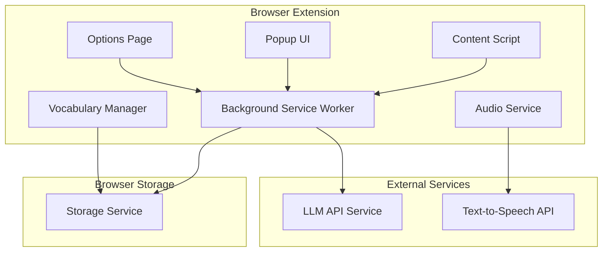

# Design Document - TransAI Browser Extension

## Overview

TransAI is a cross-browser translation extension that leverages Large Language Models (LLMs) to provide intelligent translation services with vocabulary management and learning features. The extension will be built using modern web technologies (TypeScript, React, Tailwind CSS) and support both Chrome and Edge browsers through the Manifest V3 specification.

## Architecture

### High-Level Architecture



### Component Architecture

The extension follows a modular architecture with clear separation of concerns:

1. **Content Scripts**: Injected into web pages for text selection and UI overlay
2. **Background Service Worker**: Handles API calls, storage operations, and cross-component communication
3. **Popup UI**: Main interface for quick translations and vocabulary access
4. **Options Page**: Configuration interface for API keys and settings
5. **Storage Layer**: Manages vocabulary, settings, and cache

## Components and Interfaces

### 1. Content Script Layer

**Purpose**: Handles text selection, translation UI injection, and user interactions on web pages.

**Key Components**:
- `TextSelector`: Detects and manages text selection events
- `TranslationOverlay`: Displays translation popup near selected text
- `VocabularyButton`: Provides "Add to Vocabulary" functionality

**Interfaces**:
```typescript
interface TextSelection {
  text: string;
  position: { x: number; y: number };
  context: string;
  url: string;
}

interface TranslationOverlay {
  show(selection: TextSelection): void;
  hide(): void;
  updateContent(translation: TranslationResult): void;
}
```

### 2. Background Service Worker

**Purpose**: Central hub for API communications, storage operations, and message routing.

**Key Components**:
- `MessageRouter`: Handles communication between components
- `TranslationService`: Manages LLM API calls
- `StorageManager`: Handles data persistence
- `ConfigManager`: Manages user settings and API keys

**Interfaces**:
```typescript
interface BackgroundService {
  handleTranslation(request: TranslationRequest): Promise<TranslationResult>;
  saveToVocabulary(word: VocabularyItem): Promise<void>;
  exportVocabulary(format: ExportFormat): Promise<Blob>;
  generateContent(words: string[]): Promise<GeneratedContent>;
}
```

### 3. LLM Integration Service

**Purpose**: Handles communication with various LLM APIs for translation and content generation.

**Key Components**:
- `LLMClient`: Generic client for LLM API calls
- `PromptManager`: Manages translation and generation prompts
- `ResponseParser`: Parses and validates LLM responses

**Interfaces**:
```typescript
interface LLMService {
  translate(text: string, options: TranslationOptions): Promise<TranslationResult>;
  generateSentences(words: string[], count: number): Promise<string[]>;
  generateArticle(words: string[], topic?: string): Promise<string>;
}

interface TranslationOptions {
  sourceLanguage?: string;
  targetLanguage: string;
  includeExamples: boolean;
  customPrompt?: string;
}
```

### 4. Vocabulary Management

**Purpose**: Manages vocabulary storage, retrieval, and export functionality.

**Key Components**:
- `VocabularyStore`: Handles CRUD operations for vocabulary items
- `ExportService`: Manages vocabulary export in various formats
- `SearchService`: Provides vocabulary search and filtering

**Interfaces**:
```typescript
interface VocabularyItem {
  id: string;
  word: string;
  translation: string;
  context: string;
  sourceUrl: string;
  dateAdded: Date;
  reviewCount: number;
  pronunciation?: string;
}

interface VocabularyManager {
  addWord(item: Omit<VocabularyItem, 'id' | 'dateAdded'>): Promise<VocabularyItem>;
  getWords(filter?: VocabularyFilter): Promise<VocabularyItem[]>;
  exportWords(format: ExportFormat): Promise<Blob>;
  searchWords(query: string): Promise<VocabularyItem[]>;
}
```

### 5. Audio Service

**Purpose**: Handles pronunciation playback for vocabulary words.

**Key Components**:
- `TTSService`: Text-to-speech functionality
- `AudioCache`: Caches audio files for offline playback
- `PronunciationProvider`: Manages multiple pronunciation sources

**Interfaces**:
```typescript
interface AudioService {
  playPronunciation(word: string, language: string): Promise<void>;
  getPhoneticTranscription(word: string, language: string): Promise<string>;
  preloadAudio(words: string[]): Promise<void>;
}
```

## Data Models

### Core Data Structures

```typescript
// Translation Result
interface TranslationResult {
  originalText: string;
  translatedText: string;
  sourceLanguage: string;
  targetLanguage: string;
  examples: Example[];
  confidence: number;
  timestamp: Date;
}

interface Example {
  original: string;
  translated: string;
  context?: string;
}

// User Configuration
interface UserConfig {
  apiKey: string;
  apiProvider: 'openai' | 'anthropic' | 'custom';
  defaultTargetLanguage: string;
  customPrompts: {
    translation: string;
    sentenceGeneration: string;
    articleGeneration: string;
  };
  uiPreferences: {
    theme: 'light' | 'dark' | 'auto';
    overlayPosition: 'auto' | 'top' | 'bottom';
    autoPlayPronunciation: boolean;
  };
}

// Generated Content
interface GeneratedContent {
  type: 'sentence' | 'article';
  content: string;
  usedWords: string[];
  generatedAt: Date;
}
```

### Storage Schema

```typescript
// Browser Extension Storage Structure
interface ExtensionStorage {
  vocabulary: VocabularyItem[];
  config: UserConfig;
  cache: {
    translations: Map<string, TranslationResult>;
    audio: Map<string, ArrayBuffer>;
  };
  statistics: {
    translationsCount: number;
    wordsLearned: number;
    lastUsed: Date;
  };
}
```

## Error Handling

### Error Categories and Strategies

1. **API Errors**:
   - Network failures: Retry with exponential backoff
   - Authentication errors: Prompt user to check API key
   - Rate limiting: Queue requests and implement throttling
   - Invalid responses: Fallback to cached translations or error message

2. **Storage Errors**:
   - Quota exceeded: Implement data cleanup and user notification
   - Corruption: Backup and restore mechanisms
   - Access denied: Graceful degradation with temporary storage

3. **Content Script Errors**:
   - Page compatibility: Feature detection and graceful fallbacks
   - CSP violations: Alternative injection methods
   - DOM manipulation failures: Robust element selection and error recovery

4. **User Input Errors**:
   - Invalid API keys: Real-time validation and clear error messages
   - Malformed prompts: Template validation and suggestions
   - Export failures: Format validation and alternative options

### Error Recovery Mechanisms

```typescript
interface ErrorHandler {
  handleAPIError(error: APIError): Promise<TranslationResult | null>;
  handleStorageError(error: StorageError): Promise<void>;
  handleContentScriptError(error: ContentScriptError): void;
  reportError(error: Error, context: string): void;
}
```

## Testing Strategy

### Unit Testing
- **Framework**: Jest with TypeScript support
- **Coverage**: All service classes, utility functions, and data models
- **Mocking**: LLM API responses, browser storage, and DOM interactions
- **Focus Areas**: Translation logic, vocabulary management, error handling

### Integration Testing
- **Browser APIs**: Test extension APIs, storage, and messaging
- **LLM Integration**: Test with mock API responses and error scenarios
- **Cross-browser**: Automated testing on Chrome and Edge
- **Performance**: Memory usage, response times, and storage efficiency

### End-to-End Testing
- **User Workflows**: Complete translation and vocabulary management flows
- **Browser Automation**: Puppeteer/Playwright for real browser testing
- **Cross-page Testing**: Test functionality across different websites
- **Accessibility**: Screen reader compatibility and keyboard navigation

### Manual Testing
- **Usability**: User experience and interface responsiveness
- **Edge Cases**: Unusual text selections, network failures, and browser quirks
- **Performance**: Real-world usage patterns and resource consumption
- **Security**: API key handling and data privacy

### Testing Infrastructure
```typescript
// Test Configuration
interface TestConfig {
  mockLLMResponses: boolean;
  useRealStorage: boolean;
  browserTarget: 'chrome' | 'edge' | 'both';
  testDataSets: {
    vocabulary: VocabularyItem[];
    translations: TranslationResult[];
    configurations: UserConfig[];
  };
}
```

This design provides a robust foundation for implementing the TransAI browser extension with clear component boundaries, comprehensive error handling, and thorough testing strategies. The modular architecture ensures maintainability while the well-defined interfaces enable independent development and testing of each component.