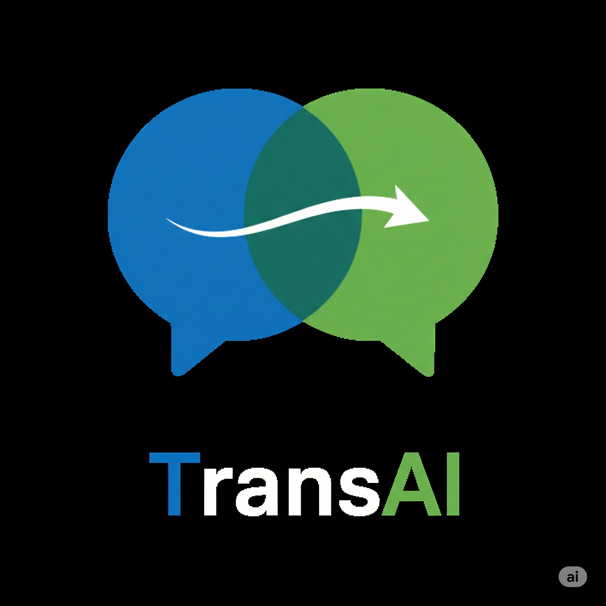

# TransAI Browser Extension

<div align="center">



**An intelligent browser extension for translation and vocabulary management powered by AI**

[](https://chrome.google.com/webstore)
[](https://microsoftedge.microsoft.com/addons)
[](https://opensource.org/licenses/MIT)
[](https://www.typescriptlang.org/)
[](https://reactjs.org/)

[Features](#features) • [Installation](#installation) • [Usage](#usage) • [Development](#development) • [Contributing](#contributing)

</div>

## ✨ Features

### 🌐 Intelligent Translation
- **Instant Translation**: Select any text on a webpage for AI-powered translations
- **Context-Aware**: Provides accurate translations with contextual examples
- **Multi-Language Support**: Supports 100+ languages with high accuracy
- **Custom Prompts**: Customize translation behavior to match your needs

### 📚 Smart Vocabulary Management
- **Personal Vocabulary**: Build and organize your vocabulary collection
- **Smart Search**: Find words quickly with advanced search and filtering
- **Progress Tracking**: Monitor your learning progress with detailed statistics
- **Export/Import**: Backup and sync your vocabulary across devices

### 🎯 AI-Powered Content Generation
- **Practice Sentences**: Generate sentences using your vocabulary words
- **Custom Articles**: Create reading material tailored to your learning level
- **Contextual Learning**: AI creates content that reinforces vocabulary usage
- **Multiple Formats**: Export generated content in various formats

### 🔊 Pronunciation Support
- **Audio Playback**: Hear correct pronunciation of words and phrases
- **Phonetic Transcription**: Visual pronunciation guides when audio unavailable
- **Multiple Accents**: Support for different regional pronunciations
- **Offline Caching**: Cache audio for offline access

### 🎨 User Experience
- **Clean Interface**: Modern, intuitive design with dark/light themes
- **Keyboard Shortcuts**: Full keyboard navigation support
- **Accessibility**: Screen reader compatible with ARIA support
- **Cross-Browser**: Works seamlessly on Chrome and Edge

### 🔒 Privacy & Security
- **Local Storage**: Your data stays on your device
- **Secure API**: Encrypted communication with AI services
- **No Tracking**: We don't collect or store your personal data
- **Open Source**: Transparent and auditable codebase

## 🚀 Installation

### From Browser Stores

#### Chrome Web Store
1. Visit the [Chrome Web Store](https://chrome.google.com/webstore)
2. Search for "TransAI Translation Extension"
3. Click "Add to Chrome"
4. Follow the setup instructions

#### Microsoft Edge Add-ons
1. Visit [Microsoft Edge Add-ons](https://microsoftedge.microsoft.com/addons)
2. Search for "TransAI Translation Extension"
3. Click "Get"
4. Follow the setup instructions

### Manual Installation (Developer Mode)

1. **Download** the latest release from [GitHub Releases](https://github.com/transai/browser-extension/releases)
2. **Extract** the ZIP file
3. **Open** Chrome/Edge and navigate to `chrome://extensions/` or `edge://extensions/`
4. **Enable** "Developer mode"
5. **Click** "Load unpacked" and select the extracted folder

## 📖 Usage

### Quick Start

1. **Install** the extension from your browser's store
2. **Click** the TransAI icon in your toolbar
3. **Configure** your AI API key (OpenAI, Anthropic, or custom)
4. **Start translating** by selecting text on any webpage!

### Basic Translation

1. **Select text** on any webpage by highlighting it
2. **Translation popup** appears automatically
3. **View translation** with examples and context
4. **Add to vocabulary** by clicking the "+" button
5. **Hear pronunciation** by clicking the speaker icon

### Vocabulary Management

1. **Open popup** by clicking the TransAI icon
2. **Browse vocabulary** in the main tab
3. **Search words** using the search bar
4. **Edit or delete** words as needed
5. **Export vocabulary** for backup or sharing

### Content Generation

1. **Navigate** to the "Content Generation" tab in the popup
2. **Select vocabulary words** you want to practice
3. **Choose content type** (sentences or articles)
4. **Generate content** and review the results
5. **Save or export** generated content

For detailed instructions, see our [User Guide](docs/USER_GUIDE.md).

## 🛠 Development

### Prerequisites

- **Node.js** 18 or higher
- **pnpm** 8 or higher
- **Chrome/Edge** browser for testing

### Setup

```bash
# Clone the repository
git clone https://github.com/transai/browser-extension.git
cd browser-extension

# Install dependencies
pnpm install

# Start development server
pnpm dev
```

### Available Scripts

```bash
# Development
pnpm dev                    # Start development with hot reload
pnpm build                  # Build for production
pnpm build:chrome          # Build for Chrome
pnpm build:edge            # Build for Edge

# Testing
pnpm test                  # Run unit tests
pnpm test:watch           # Run tests in watch mode
pnpm test:e2e             # Run end-to-end tests
pnpm test:cross-browser   # Run cross-browser tests

# Code Quality
pnpm lint                 # Run ESLint
pnpm type-check          # TypeScript type checking
```

### Project Structure

```
src/
├── background/           # Background service worker
├── content/             # Content scripts for web pages
├── popup/               # Extension popup interface
├── options/             # Options/settings page
├── services/            # Core business logic
├── components/          # Reusable React components
├── types/               # TypeScript type definitions
├── utils/               # Utility functions
└── test/                # Unit and integration tests

e2e/                     # End-to-end tests
docs/                    # Documentation
scripts/                 # Build and utility scripts
```

For detailed development information, see our [Developer Guide](docs/DEVELOPER_GUIDE.md).

## 🧪 Testing

We maintain comprehensive test coverage across multiple levels:

### Unit Tests
```bash
pnpm test                # Run all unit tests
pnpm test:watch         # Watch mode for development
```

### Integration Tests
```bash
pnpm test:cross-browser # Cross-browser compatibility tests
```

### End-to-End Tests
```bash
pnpm test:e2e           # Full user workflow tests
pnpm test:e2e:headed    # Run with browser UI visible
pnpm test:e2e:debug     # Debug mode with breakpoints
```

### Test Coverage
- **Unit Tests**: Service layer, utilities, components
- **Integration Tests**: Cross-component communication
- **E2E Tests**: Complete user workflows, accessibility, cross-browser compatibility

## 🤝 Contributing

We welcome contributions from the community! Here's how you can help:

### Ways to Contribute

- 🐛 **Report Bugs**: Open an issue with detailed reproduction steps
- 💡 **Suggest Features**: Share ideas for new functionality
- 📝 **Improve Documentation**: Help make our docs clearer and more comprehensive
- 🔧 **Submit Code**: Fix bugs or implement new features
- 🌍 **Translations**: Help translate the extension to more languages

### Development Process

1. **Fork** the repository
2. **Create** a feature branch: `git checkout -b feature/amazing-feature`
3. **Make** your changes with tests
4. **Test** thoroughly: `pnpm test && pnpm test:e2e`
5. **Commit** with conventional commits: `git commit -m 'feat: add amazing feature'`
6. **Push** to your branch: `git push origin feature/amazing-feature`
7. **Open** a Pull Request

### Code Standards

- **TypeScript**: Strict mode, no `any` types
- **ESLint**: Enforced code style
- **Testing**: Tests required for new features
- **Documentation**: Update docs for user-facing changes

See our [Contributing Guide](CONTRIBUTING.md) for detailed guidelines.

## 📄 License

This project is licensed under the MIT License - see the [LICENSE](LICENSE) file for details.

## 🙏 Acknowledgments

- **OpenAI** and **Anthropic** for providing excellent AI APIs
- **React** and **TypeScript** communities for amazing tools
- **Playwright** team for robust testing framework
- **Contributors** who help make this project better

## 📞 Support

- 📧 **Email**: support@transai-extension.com
- 🐛 **Bug Reports**: [GitHub Issues](https://github.com/transai/browser-extension/issues)
- 💬 **Discussions**: [GitHub Discussions](https://github.com/transai/browser-extension/discussions)
- 📖 **Documentation**: [User Guide](docs/USER_GUIDE.md) | [Developer Guide](docs/DEVELOPER_GUIDE.md)

## 🗺 Roadmap

### Upcoming Features

- 📱 **Mobile Support**: Extension for mobile browsers
- 🔄 **Cloud Sync**: Synchronize vocabulary across devices
- 🎮 **Gamification**: Learning streaks, achievements, and challenges
- 🤖 **Advanced AI**: More sophisticated content generation
- 🌍 **Offline Mode**: Core features without internet connection
- 📊 **Analytics**: Detailed learning progress insights

### Version History

- **v1.0.0** - Initial release with core translation and vocabulary features
- **v0.9.0** - Beta release with content generation
- **v0.8.0** - Alpha release with basic translation

---

<div align="center">

**Made with ❤️ by the TransAI Team**

[⭐ Star us on GitHub](https://github.com/transai/browser-extension) • [🐦 Follow on Twitter](https://twitter.com/transai) • [📧 Newsletter](https://transai.dev/newsletter)

</div>